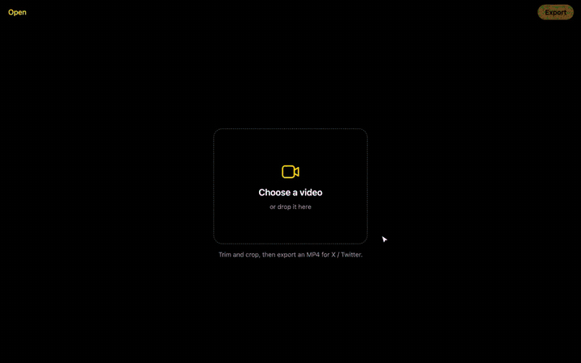

# Twitter Editor Inbuilt

An iPhone Photos–style video editor built into the X / Twitter post composer. Trim and crop a clip right where you post it. The export takes seconds and runs on your machine; nothing is uploaded anywhere except to X when you post.

It adds an **Edit video** button to the composer toolbar, next to GIF:

## Features

- **Trim** with a filmstrip and yellow handles. Hold the middle of the selection to slide it, tap to jump, or drag the playhead to scrub.
- **Crop** freeform, or to Original, 16:9, Square, 4:5 or 9:16. Drag the box to reposition it.
- **Mute** to leave the sound out.
- **Fast export** to an H.264 + AAC MP4 through WebCodecs. When nothing needs re-encoding, the video data is copied as is.
- **iPhone clips** work, including HEVC and portrait videos with rotation metadata.
- **X's limits** are shown in the editor: it warns past 2:20 (the limit for non-Premium accounts) and caps the export at 1920px on the longest side.

## Install

The extension isn't in the Chrome Web Store, so load it unpacked:

1. Download this repo (**Code → Download ZIP**) and unzip it, or `git clone` it.
2. Open `chrome://extensions` and turn on **Developer mode**.
3. Click **Load unpacked** and choose the folder.

This works in Chrome and Chromium browsers such as Helium, Arc, Brave and Edge. It needs a browser with WebCodecs.

## Use

**In X's composer:**

1. Attach a video the usual way, then press **Edit video** in the toolbar. If nothing is attached yet, the button asks you to pick one.
2. Trim and crop.
3. Press **Done**. The edited clip replaces the attached video. **Cancel** or Esc leaves the post as it was.

**On its own:** click the toolbar icon to open the editor in a tab. **Export** gives you an MP4 to download.

## How it works

| File | Role |
|---|---|
| `content.js` | Adds the toolbar button on x.com and twitter.com, opens the editor in a shadow DOM over the page, and hands the result to X's own file input. |
| `editor.js` / `editor.css` | The editor, mountable on its own page or inside X. |
| `editor.html`, `editor-page.js`, `background.js` | The standalone editor tab opened from the toolbar icon. |
| `vendor/mediabunny.min.mjs` | [Mediabunny](https://github.com/Vanilagy/mediabunny) (MPL-2.0), which does the demuxing, WebCodecs transcoding and MP4 muxing. |

The extension requests no permissions and has no network code; the only thing that leaves your machine is what you post on X.

## Limitations

- X changes its markup from time to time. If the button disappears, the toolbar selectors in `content.js` probably need updating.
- Some iPhone videos include a spatial-audio track that browsers can't decode. The editor uses the first audio track the browser can read. If none can be read, it asks before exporting without sound.
- One video at a time, with no filters or text overlays.

## License

[MIT](LICENSE). `vendor/mediabunny.min.mjs` is under the MPL-2.0; see `vendor/mediabunny.LICENSE`.
